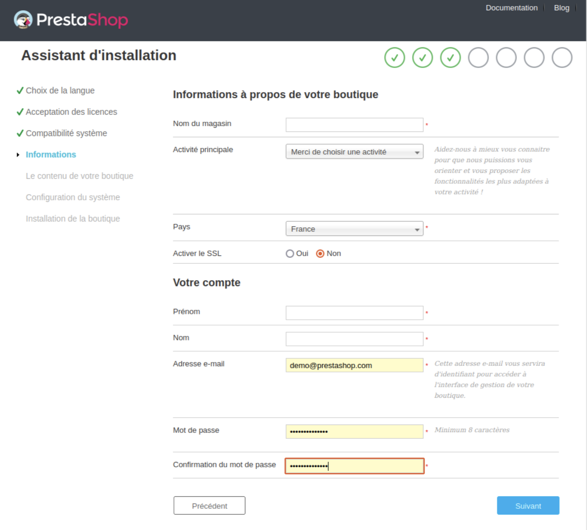

# Installer PrestaShop


Ce chapitre est à destination de ceux qui souhaitent **installer PrestaShop sur un hébergement en ligne.**

\
Si vous souhaitez installer PrestaShop sur votre ordinateur, suivez les instructions situées ici : [Installer PrestaShop sur votre propre ordinateur.](installer-prestashop-ordinateur.md)

Si vous avez déjà lu les instructions de cette autre page, allez directement à la section ["Créer une base de données pour votre boutique" ](installer-prestashop.md#creer-une-base-de-donnees-pour-votre-boutique)de cette page.


## Installation

PrestaShop est très facile à installer. Une fois que tous les fichiers sont sur votre serveur web, vous pouvez normalement commencer la configuration de votre boutique après moins de 5 minutes dans la plupart des cas. En effet, le processus d’installation est très simple car l’installateur s’occupe de tout.&#x20;

Les utilisateurs moins expérimentés mettront peut-être 10 à 20 minutes pour réaliser l’installation.

Avant de commencer, assurez-vous que toutes les exigences sont remplies :&#x20;

* **espace serveur chez un fournisseur d’hébergement,**&#x20;
* **nom de domaine,**&#x20;
* **client FTP,**
* **éditeur de texte.**&#x20;

Veillez d’abord à suivre les instructions figurant dans la section **“Ce dont vous avez besoin pour commencer”**, disponible ici :


[ce-dont-vous-avez-besoin.md](ce-dont-vous-avez-besoin.md)


Notre partenaire d’hébergement web **1&1 IONOS** vous propose une installation en 1 clic pour vous faire gagner du temps et vous aider à démarrer encore plus vite. Le temps d’installation peut ainsi être considérablement réduit pour les utilisateurs inexpérimentés.

* [1&1 IONOS Hosting](https://www.ionos.fr/solutions-ecommerce/hebergement-prestashop?ac=OM.FR.FRs96K414092T7073a)

Ces hébergeurs web utilisent principalement les bibliothèques de scripts suivantes :

* [Installatron](http://installatron.com/apps?locale=en#cmd=browser\&display=prestashop)
* [Softaculous](http://www.softaculous.com/apps/ecommerce/PrestaShop)

Certains de ces scripts prennent même en charge la mise à jour en 1 clic, ce qui permet de gagner un temps précieux.

D’autres hébergeurs ont leurs propres scripts d’installation. Pour de plus amples informations, renseignez-vous auprès de votre hébergeur.

## Instructions d’installation rapides

Voici un ensemble d’instructions rapides pour les utilisateurs qui connaissent déjà bien le processus d’installation des applications PHP/MySQL sur un serveur web. Vous trouverez des instructions détaillées dans la section suivante de ce chapitre si nécessaire.

1. Si vous ne l’avez pas fait, **téléchargez et décompressez le package PrestaShop.**
2. Si possible, **créez une base de données** pour la boutique PrestaShop sur votre serveur web. Si aucun utilisateur MySQL ne dispose de tous les droits d’accès et de modification pour cette base de données, créez-en un.
3. **Téléchargez-y** les trois fichiers de PrestaShop en ligne à l’emplacement sélectionné sur votre serveur web, y compris le fichier .zip (il se décompressera automatiquement ensuite).
4. **Exécutez le script** d’installation de PrestaShop en accédant à l’URL publique de l’emplacement sélectionné dans un navigateur web. Il doit s’agir de l’URL où vous avez mis les fichiers de PrestaShop en ligne.
5. **Suivez les instructions** affichées sur chaque écran de l’installateur.
6. Une fois l’installation terminée, **supprimez le dossier `/install` et notez le nouveau nom du dossier `/admin`**, nom que vous seul connaissez pour des raisons de sécurité.

PrestaShop est désormais installé et prêt à être configuré ! Consultez maintenant le chapitre [Premiers pas avec PrestaShop 8](http://doc.prestashop.com/display/PS17/Premiers+pas+avec+PrestaShop+1.7) du guide de l’utilisateur.

## Instructions détaillées

### Télécharger et décompresser l’archive de PrestaShop

Vous pouvez télécharger la dernière version de PrestaShop sur Github, disponible à cette adresse :  [https://github.com/PrestaShop/PrestaShop/releases](https://github.com/PrestaShop/PrestaShop/releases)


Vous n'avez **pas besoin d'un compte GitHub pour télécharger PrestaShop.**


<figure><figcaption>
Page "Releases" (versions) de PrestaShop sur GitHub
</figcaption></figure>

Vous n’avez ici qu’une option de téléchargement : **la dernière version stable**, adaptée à toutes sortes de boutiques en ligne.


Si vous avez besoin de télécharger une version antérieure, rendez-vous sur la page de [Releases GitHub](https://github.com/PrestaShop/PrestaShop/releases) et téléchargez la version désirée.

Il **n’est pas conseillé d’utiliser une autre version que la version stable actuelle.**


**Cliquez** sur la version que vous souhaitez télécharger, cliquez sur la section **"Assets"** et enregistrez l’archive .zip sur votre ordinateur (par exemple, sur votre Bureau). Vous devez obtenir un fichier nommé “prestashop\_8.0.4.zip” (ou équivalent, selon le numéro de version):

<figure><figcaption>
Page de téléchargement GitHub de PrestaShop 8.0.4. La section "Assets" est situé en bas de la page.
</figcaption></figure>

Le fichier téléchargé est une archive .zip. Pour poursuivre le processus, **vous devez décompresser l’archive**.

Si votre système d’exploitation ne prend pas en charge les fichiers .zip, vous pouvez télécharger et installer un outil dédié tel que :

| Windows                                                                                                               | MacOS                                                                                                 |
| --------------------------------------------------------------------------------------------------------------------- | ----------------------------------------------------------------------------------------------------- |
| 
<strong>7-Zip</strong>

<a href="http://www.7-zip.org/">http://www.7-zip.org/</a>
                         | 
<strong>iZip</strong> <a href="http://www.izip.com/">http://www.izip.com/</a>
               |
| 
<strong>WinZip</strong> <a href="http://www.winzip.com/win/en/index.htm">http://www.winzip.com/win/</a>
     | 
<strong>WinZip</strong> <a href="http://www.winzip.com/mac/">http://www.winzip.com/mac/</a>
 |
| 
<strong>WinRAR</strong> <a href="https://www.win-rar.com/start.html?&#x26;L=10">https://www.win-rar.com</a>
 |                                                                                                       |

Procédez à l’extraction du contenu de l’archive vers un emplacement connu de votre disque dur (comme le Bureau).&#x20;


**Ne mettez pas le fichier .zip directement en ligne sur votre serveur web**.


L’archive .zip possède trois éléments à sa racine :

* **Le fichier “prestashop.zip”**, qui contient tous les fichiers de PrestaShop que vous mettrez bientôt en ligne sur votre serveur web.
* **Le fichier “Install\_PrestaShop.html”**, qui ouvre cette page dans votre navigateur par défaut.
* **Le fichier “index.php”**, qui lance l’installation.


Le fichier “Install\_PrestaShop.html” **ne doit pas être mis en ligne sur votre serveur web.**


### Mettre PrestaShop en ligne

Vous avez maintenant un espace d’hébergement à votre disposition (si ce n’est pas le cas, lisez le chapitre “Ce dont vous avez besoin pour commencer”), ainsi qu’un dossier sur votre disque dur dans lequel l’archive PrestaShop est décompressée.

Dans cette étape, vous allez mettre les fichiers de PrestaShop en ligne sur votre espace d’hébergement. Pour ce faire, **connectez votre ordinateur à votre serveur en utilisant un outil appelé “client FTP”** (vous avez normalement installé cet outil lors de la lecture du chapitre [“Ce dont vous avez besoin pour commencer”](ce-dont-vous-avez-besoin.md)). Nous allons utiliser l’outil gratuit FileZilla ([http://filezilla-project.org/](http://filezilla-project.org)).

1. **Connectez-vous à votre espace d’hébergement** à l’aide du client FTP et des identifiants de connexion fournis par votre hébergeur (si vous ne les avez pas, contactez votre hébergeur).
2. Une fois que vous êtes connecté, vous pouvez **transférer les fichiers de PrestaShop** depuis votre ordinateur vers votre serveur.
3. Dans votre client FTP, **parcourez vos dossiers locaux** pour trouver celui contenant les fichiers PrestaShop. **Laissez-le ouvert** dans la section “Site local” située sur la gauche.

4. Dans la section “Site distant” (située à droite), **naviguez jusqu’à l’emplacement où vous souhaitez que PrestaShop soit publiquement disponible** (racine du domaine, sous-dossier, sous-domaine...). L’emplacement peut varier selon votre hébergeur et vos besoins :

#### Votre hébergeur :

* Certains hébergeurs peuvent vous obliger à placer vos fichiers dans un dossier spécifique, comme `/htdocs`, `/public_html`, `/web`, `/www`, `/`[votrenomdedomaine.com](http://yourdomainname.com), etc.
* Le serveur FTP d’autres hébergeurs vous connectera directement à l’espace de mise en ligne approprié.

#### Vos besoins :

* Si vous voulez que votre boutique soit **le site web principal pour votre nom de domaine** (ex.: [http://www.exemple.com](http://www.example.com))
  * mettez **PrestaShop en ligne au niveau du dossier racine** de l’espace de chargement (qui peut varier en fonction de l’hébergeur).
* Si vous voulez que votre boutique soit **dans un sous-dossier de votre nom de domaine** ([http://www.exemple.com/boutique](http://www.example.com/shop)),&#x20;
  * **Créez un dossier** via FileZilla (effectuez un clic droit et choisissez l’option “Créer un répertoire”), puis **mettez PrestaShop en ligne dans ce dossier.**
* Si vous voulez que votre boutique soit un sous-domaine de votre nom de domaine ([http://boutique.exemple.com](http://shop.example.com)),&#x20;
  1. Créez un sous-domaine.&#x20;
  2. Une fois le sous-domaine créé, **naviguez jusqu’au dossier du sous-domaine** et **mettez PrestaShop en ligne.**


Cette méthode dépendra de votre hébergeur.

Parfois, il vous suffira d’ajouter un nouveau dossier avec votre client FTP ; dans d’autres cas, vous devrez créer le sous-domaine via le panneau d’administration de votre hébergeur.

Commencez par lire la documentation d’aide de votre hébergeur.


Dans FileZilla, vous avez maintenant le dossier local où vous conservez les fichiers de PrestaShop provenant de l’archive .zip, sur le côté gauche, et l’emplacement de destination, à droite.&#x20;

La mise en ligne est simple, même pour les utilisateurs inexpérimentés :&#x20;

1. **Sélectionnez** les trois fichiers dans le dossier local (utilisez Ctrl+A)
2. **Faites-les glisser** dans le dossier distant (ou effectuez un **clic droit** sur la sélection et choisissez **“Mettre en ligne”** dans le menu contextuel).

### Créer une base de données pour votre boutique

Avant de pouvoir installer PrestaShop, vous devez veiller à ce que votre serveur MySQL possède une base de données opérationnelle pour les données de PrestaShop. Si ce n’est pas le cas, vous devez en créer une.

La création d’une base de données peut se faire à l’aide de n’importe quel outil d’administration de bases de données. Nous allons utiliser l’outil gratuit phpMyAdmin ([http://www.phpmyadmin.net/](http://www.phpmyadmin.net)), qui est préinstallé sur la plupart des solutions d’hébergement web.


Certains hébergeurs préfèrent que les clients utilisent un panneau de contrôle graphique comme cPanel, Plesk ou un panneau personnalisé. Assurez-vous de lire la documentation de votre hébergeur sur la gestion des bases de données MySQL et créez une base de données pour votre boutique en suivant précisément ses explications.


**Pour créer une base de données, connectez-vous à phpMyAdmin** à l’aide des identifiants fournis par votre hébergeur. Votre compte devrait être accessible via une URL standard associée à votre nom de domaine ou au nom de domaine de l’hébergeur.

Dans la colonne de gauche, vous pouvez consulter les bases de données actuellement disponibles sur votre serveur MySQL.&#x20;


Certaines sont utilisées soit par phpMyAdmin, soit par l’hébergeur ; n’y touchez pas : `phpmyadmin`, `mysql`, `information_schema`, `performance_schema`, etc. Lisez la documentation de votre hébergeur pour savoir si l’une d’entre elles peut être utilisée comme base de données par défaut.


1. Vous pouvez **créer une nouvelle base de données** en allant dans l’onglet “Base de données” et en utilisant le formulaire central nommé **“Créer une nouvelle base de données”.**&#x20;
2. Il vous suffit de **saisir un nom unique** et de cliquer sur **“Créer”**. Le nom de la base de données s’ajoutera à la liste située à gauche. Vous pouvez maintenant utiliser cette base de données pour stocker les données de PrestaShop.

### Lancer l’installateur automatique

Venons-en à l’installation de PrestaShop à proprement parler.

L’installateur automatique de PrestaShop rend le processus d’installation relativement simple. Quelques minutes vous suffiront normalement pour procéder à l’installation. Assurez-vous de lire chaque page attentivement afin de ne manquer aucune information.

Pour lancer l’installateur,

1. **Naviguez simplement jusqu’à l’emplacement de PrestaShop** sur votre serveur web : le script détecte automatiquement que PrestaShop n’est pas encore installé et vous dirige vers l’installateur automatique.&#x20;
2. Dans le même temps, le fichier prestashop.zip que vous aviez mis en ligne est décompressé.&#x20;
3. À présent, tous les fichiers de PrestaShop sont disponibles sur votre serveur web.

Si vous procédez à une installation sur votre ordinateur, cette dernière doit être effectuée dans le dossier PrestaShop sur votre serveur web local, qui doit être disponible à l’adresse [`http://127.0.0.1/prestashop`](http://127.0.0.1/prestashop).

À partir de là, vous n’avez plus qu’à lire, cliquer et remplir quelques formulaires.

Il y a **6 étapes**. En haut de la page, l’assistant d’installation vous indique où vous en êtes dans le processus : les cercles gris deviennent des coches vertes à chaque étape terminée.

## **Étape 1 : page d’accueil**

Cette page est une présentation rapide du processus d’installation. Vous pouvez choisir la langue dans laquelle l’installateur affiche ses instructions.

<figure><figcaption>
L'assistant d'installation PrestaShop, étape 1 : Bienvenue sur l'installateur
</figcaption></figure>

**Sélectionnez la langue** dans laquelle vous souhaitez voir l’installateur s’afficher, puis cliquez sur le bouton **“Suivant”**.&#x20;

Cette étape vous permettra de **définir la langue par défaut de votre installation de PrestaShop**, mais vous aurez aussi la possibilité d’activer d’autres langues.


Vous avez également un lien vers le site de la documentation ([https://docs.prestashop-project.org](https://docs.prestashop-project.org/v.8-documentation/v/english/)) et un lien vers notre offre de support.&#x20;

Pour en savoir plus sur notre service de support, rendez-vous sur [https://prestashop.fr/support/](https://prestashop.fr/support/).


## **Étape 2 : licences de PrestaShop**

Cette deuxième page énonce une condition simple : PrestaShop est gratuit et distribué dans le cadre d’un ensemble de licences open source. Vous ne pouvez pas utiliser ce logiciel si vous n’acceptez pas les conditions des licences. Dans cette étape, il vous est demandé d’accepter clairement ces conditions.

<figure><figcaption>
L'assistant d'installation PrestaShop, étape 2 : Acceptation des licences
</figcaption></figure>

**Vous devez accepter ces deux licences** pour installer PrestaShop.

Pour accéder à l’étape suivante, vous devez cocher la case **“J’accepte les conditions ci-dessus”**, puis cliquer sur **“Suivant”.**&#x20;

Si vous n’acceptez pas les licences, vous ne pourrez pas installer PrestaShop. Vous ne pourrez même pas cliquer sur le bouton “Suivant”.


Lisez les licences de PrestaShop :

* _Open Software License 3.0_ de PrestaShop, également consultable sur la page [http://www.opensource.org/licenses/OSL-3.0](http://www.opensource.org/licenses/OSL-3.0).
* _Academic Free License 3.0_ pour les modules et les thèmes, également consultable à la page [http://opensource.org/licenses/AFL-3.0](http://opensource.org/licenses/AFL-3.0).


## **Étape 3 : Compatibilité système**&#x20;

La troisième page consiste en un test rapide de tous les paramètres du serveur.&#x20;

Dans la plupart des cas, vous ne la verrez pas. En effet, si aucune erreur n’est trouvée, vous êtes directement dirigé vers la quatrième page “Informations de la boutique”. Vous pouvez toujours consulter la troisième page en cliquant sur le lien “Compatibilité système” situé dans la barre latérale gauche.


Si une erreur se produit pendant le test du serveur au cours de la troisième étape, l’installateur affiche la page “Compatibilité système” avec toutes les vérifications qui ont échoué.


**Compatibilité système**

Cette page permet de vérifier que la configuration de votre serveur est correcte : paramètres PHP, permissions d’accès aux fichiers et dossiers, outils tiers, etc.

<figure><figcaption>
L'assistant d'installation PrestaShop, étape 3 : vérification de la compatibilité système.
</figcaption></figure>


Si une erreur se produit, l’installateur s’arrête et vous pouvez consulter les détails techniques qui nécessitent une correction, que ce soit la modification de la configuration PHP ou la mise à jour des permissions d’accès aux fichiers.


Voici une liste des tests réalisés durant la troisième étape :

| **Test**                                                            | **Comment/où régler le problème ?**                                                                           |
| ------------------------------------------------------------------- | ------------------------------------------------------------------------------------------------------------- |
| La version PHP 5.6 (ou une version ultérieure) est-elle installée ? | Serveur web                                                                                                   |
| PrestaShop peut-il mettre des fichiers en ligne ?                   | Fichier php.ini (`file_uploads`)                                                                              |
| PrestaShop peut-il créer de nouveaux fichiers et dossiers ?         | Explorateur de fichiers / client FTP / ligne de commande                                                      |
| La bibliothèque GD est-elle installée ?                             | Fichier php.ini (`extension=`[php\_gd2.so](http://php\_gd2.so))                                               |
| La prise en charge de MySQL est-elle activée ?                      | Fichier php.ini (`extension=`[php\_pdo\_mysql.so](http://php\_pdo\_mysql.so))                                 |
| Permission d’écriture récursive sur \~/config/                      | Explorateur de fichiers / client FTP / ligne de commande                                                      |
| Permission d’écriture récursive sur \~/cache/                       | Explorateur de fichiers / client FTP / ligne de commande                                                      |
| Permission d’écriture récursive sur \~/log/                         | Explorateur de fichiers / client FTP / ligne de commande                                                      |
| Permission d’écriture récursive sur \~/img/                         | Explorateur de fichiers / client FTP / ligne de commande                                                      |
| Permission d’écriture récursive sur \~/mails/                       | Explorateur de fichiers / client FTP / ligne de commande                                                      |
| Permission d’écriture récursive sur \~/modules/                     | Explorateur de fichiers / client FTP / ligne de commande                                                      |
| Permission d’écriture récursive sur \~/override/                    | Explorateur de fichiers / client FTP / ligne de commande                                                      |
| Permission d’écriture récursive sur \~/themes/default/lang/         | Explorateur de fichiers / client FTP / ligne de commande                                                      |
| Permission d’écriture récursive sur \~/themes/default/pdf/lang/     | Explorateur de fichiers / client FTP / ligne de commande                                                      |
| Permission d’écriture récursive sur \~/themes/default/cache/        | Explorateur de fichiers / client FTP / ligne de commande                                                      |
| Permission d’écriture récursive sur \~/translations/                | Explorateur de fichiers / client FTP / ligne de commande                                                      |
| Permission d’écriture récursive sur \~/upload/                      | Explorateur de fichiers / client FTP / ligne de commande                                                      |
| Permission d’écriture récursive sur \~/download/                    | Explorateur de fichiers / client FTP / ligne de commande                                                      |
| Permission d’écriture récursive sur \~/sitemap.xml                  | Explorateur de fichiers / client FTP / ligne de commande                                                      |
| PrestaShop peut-il ouvrir des URL externes ?                        | Fichier [php.in](http://php.in) (`allow_url_fopen`)                                                           |
| L’option “register global” de PHP est-elle désactivée ?             | Fichier php.ini (`register_globals`)                                                                          |
| La compression GZIP est-elle activée ?                              | Fichier .htaccess                                                                                             |
| L’extension Mcrypt est-elle disponible ?                            | Fichier php.ini (voir [http://php.net/manual/fr/mcrypt.setup.php](http://php.net/manual/en/mcrypt.setup.php)) |
| L’option “magic quotes” de PHP est-elle désactivée ?                | Fichier php.ini (`magic_quotes_gpc`)                                                                          |
| L’extension Dom est-elle chargée ?                                  | `--enable-dom`, option d’heure de compilation                                                                 |
| L’extension PDO MySQL est-elle chargée ?                            | Fichier php.ini (`extension=`[php\_pdo\_mysql.so](http://php\_pdo\_mysql.so))                                 |

### Mettre à jour les droits d'accès aux fichiers

La modification de la configuration de PHP doit être expliquée en détail : elle s'effectue au cas par cas et elle dépend de votre niveau d’accès à votre serveur.

En revanche, la mise à jour des permissions d’accès aux fichiers est plus facile à expliquer.

Les permissions correspondent aux droits d’accès accordés par un système de fichiers à certains utilisateurs ou groupes d’utilisateurs pour contrôler leur capacité à afficher des fichiers et dossiers ou à y apporter des modifications. L’installateur a besoin d’apporter des modifications aux fichiers que vous avez mis en ligne. Si le système de fichiers n’autorise pas ces modifications, l’installateur ne peut pas terminer son processus.

Par conséquent, si l’installateur indique que certains fichiers ou dossiers n’ont pas les permissions appropriées, vous devez modifier ces permissions vous-même. Pour ce faire, vous devrez accéder à vos fichiers sur votre serveur web et donc utiliser votre client FTP (FileZilla, par exemple) ou la ligne de commande.

**Pour mettre à jour les droits d'accès aux fichiers,**&#x20;

1. **Connectez-vous** à votre compte de serveur à l’aide de votre client FTP
2. **Naviguez** jusqu’au dossier de PrestaShop et trouvez les **dossiers nécessitant une modification de permission** selon l’installateur.

### Mettre à jour CHMOD

La modicfication des permissions d’accès d’un fichier ou d’un dossier sur un système Unix/Linux se nomme **“CHMOD”**, d’après la commande du même nom (voir : [https://fr.wikipedia.org/wiki/Chmod](http://en.wikipedia.org/wiki/Chmod))

Vous trouverez une explication des permissions de fichiers ici : [http://www.math-linux.com/linux-2/tutoriels-linux/article/droit-et-permission-d-acces-aux-fichiers](http://www.elated.com/articles/understanding-permissions/)).

\
Donner un “accès en écriture” à des fichiers ou dossiers se dit “faire un CHMOD 755” ou “un CHMOD 775”, en fonction de l’hébergeur.


Certains hébergeurs peuvent vous demander d’utiliser CHMOD 777 bien que cela ne soit recommandé que pour un besoin ponctuel.

\
Si vous devez faire un CHMOD 777 pour installer PrestaShop, faites en sorte de repasser à un réglage plus sûr (par exemple, 775 pour les dossiers et 664 pour les fichiers) après avoir terminé l’installation.

\
Lisez attentivement la documentation de votre hébergeur.


Grâce à FileZilla (et à la plupart des clients FTP), vous n’avez pas à utiliser de commande Unix. La plupart des clients FTP vous permettent de changer les permissions facilement avec une interface graphique.

Une fois que vous avez trouvé le fichier ou le dossier qui nécessite une modification,&#x20;

* **Faites un clic droit dessus** et choisissez **“Droits d’accès au fichier”** dans le menu contextuel. Une petite fenêtre s’ouvre.

En fonction de la configuration de votre serveur (sur laquelle vous n’avez pas forcément la main), vous devrez avoir les deux colonnes **“Lire”** et **“Exécuter”** cochées, et au moins les lignes **“Propriétaire”** et **“Groupe”** cochées pour la colonne **“Écrire”**.&#x20;


Certains hébergeurs peuvent vous demander de cocher la case “Écrire” publique.&#x20;

Faites toutefois attention car **laisser n’importe quel utilisateur du serveur web modifier le contenu de votre dossier PrestaShop est rarement une bonne idée.**


Il peut également être nécessaire de modifier les permissions d’accès aux fichiers et aux sous-dossiers de certains dossiers. Dans ce cas, cochez la case **“Récursion dans les sous-répertoires”**.

Si vous modifiez les permissions dans votre client FTP, vous devez régulièrement vérifier que vous avez effectué les bonnes modifications en exécutant à nouveau les tests de compatibilité de l’installateur : cliquez sur **“Rafraîchir ces informations”** aussi souvent que nécessaire.\
**Une fois tous les indicateurs verts**, vous pouvez cliquer sur **“Suivant”**.&#x20;

Si vous n’arrivez pas à faire en sorte qu’ils soient tous verts, assurez-vous au moins que l’installateur affiche le message **“La compatibilité de PrestaShop avec votre environnement système a été vérifiée !”** en haut de la page.

## **Étape 4 : Informations de la boutique**

C’est ici que vous pouvez commencer à personnaliser votre boutique : en lui donnant un nom, en indiquant son activité principale et en renseignant les données personnelles du propriétaire de la boutique (ce qui implique des obligations juridiques dans la plupart des pays).


**Ne mettez pas de deux-points dans le nom de votre boutique** au risque de provoquer le dysfonctionnement de certaines fonctionnalités (par exemple, l’envoi d’e-mails).

Vous pouvez remplacer les deux-points par **un tiret** si vous souhaitez avoir deux parties dans le titre.

Écrivez par exemple utilisez "MaBoutique - La meilleure boutique pour acheter" au lieu de "MaBoutique : La meilleure boutique pour acheter".


<figure><figcaption>
L'assistant d'installation PrestaShop, étape 4 : informations de la boutique
</figcaption></figure>

C’est également dans cette section que vous choisissez le mot de passe pour vous connecter au panneau d’administration de votre boutique. Choisissez-le bien pour pouvoir vous en souvenir tout en faisant en sorte qu’il soit sécurisé !

Cliquez sur **“Suivant”** pour continuer.

## **Étape 5 : Configuration système**

Cette page contient un formulaire vous permettant d’indiquer à PrestaShop l’emplacement du serveur de bases de données et la base de données à utiliser, ainsi que quelques autres détails.&#x20;

En théorie, votre hébergeur web vous a fourni toutes ces informations.

<figure><figcaption>
L'assistant d'installation PrestaShop, étape 5 : connexion à la base de données.
</figcaption></figure>

**Renseignez tous les champs** en indiquant les identifiants de connexion à la base de données fournis par votre hébergeur :

* **Adresse du serveur de bases de données**. C’est le nom d’hôte de votre serveur MySQL. Il peut être associé à votre nom de domaine (par exemple, [http://sql.exemple.com](http://sql.example.com)) ou à votre hébergeur (par exemple, [http://mysql2.alwaysdata.com](http://mysql2.alwaysdata.com)), ou il peut simplement s’agir d’une adresse IP (par exemple, 46.105.78.185).
* **Nom de la base de données**. C’est le nom de la base de données où vous voulez que PrestaShop stocke ses données. Il s’agit soit d’une base de données existante sur votre serveur MySQL, soit de la base que vous avez créée à l’aide de phpMyAdmin (ou tout autre outil SQL) dans la section “Créer une base de données pour votre boutique” du présent guide.
* **Identifiant de connexion à la base de données**. C’est le nom de l’utilisateur MySQL qui a accès à votre base de données.
* **Mot de passe de la base de données**. C’est le mot de passe de l’utilisateur MySQL.
* **Moteur de bases de données**. Le moteur de bases de données est le cœur de votre serveur de bases de données. InnoDB est le moteur par défaut. Il est recommandé de l’utiliser même si les plus expérimentés d’entre vous préféreront peut-être choisir un autre moteur. En règle générale, il n’est pas nécessaire de modifier le paramètre par défaut.
* **Préfixe de tables**. C’est le préfixe de vos tables de base de données. Le réglage par défaut est “`ps_`”, ce qui donne des tables SQL PrestaShop comme “`ps_cart`” ou “`ps_customer`”.&#x20;


Si vous avez besoin d’installer plusieurs instances de PrestaShop sur la même base de données, vous devez utiliser un préfixe différent pour chaque installation.&#x20;

Nous vous recommandons de créer une base de données par installation de PrestaShop, si votre hébergeur le permet.&#x20;

Mieux encore : ne faites qu’une installation de PrestaShop et activez la fonctionnalité [multiboutique](../guide-utilisateur/configurer-boutique/parametres-avances/multiboutique.md) afin de gérer plusieurs boutiques depuis la même zone d’administration de PrestaShop.


* **Option de suppression des tables**. Cette option n’est disponible qu’en mode développeur. Lorsque vous réinstallez PrestaShop, vous pouvez choisir de supprimer les tables de base de données de PrestaShop existantes afin de recommencer de zéro.

1. Cliquez sur le bouton **“Tester la connexion à la base de données”** afin de vous assurer que vous avez saisi les bonnes informations de serveur.
2. Cliquez sur **“Suivant”** : l’installation commence avec la configuration de votre boutique et le remplissage des tables de la base de données, etc.&#x20;

Cette opération peut prendre quelques minutes : veuillez patienter et ne pas toucher votre navigateur !

<figure><figcaption>
L'assistant d'installation PrestaShop, étape 5 : création des tables de la base de données.
</figcaption></figure>

L’installateur effectue les opérations suivantes :

* Crée le fichier `settings.inc.php` et indique vos paramètres.
* Crée les tables de base de données.
* Crée la boutique par défaut avec ses langues par défaut.
* Renseigne les tables de la base de données.
* Configure les informations de la boutique.
* Installe les modules par défaut.
* Installe les données de démonstration (produits, catégories, utilisateurs, pages CMS, etc.).
* Installe le thème.

Une fois cette étape terminée, votre boutique est installée et prête à être configurée.

### Terminer l’installation

Comme vous pouvez le lire sur la dernière page du processus d’installation, **il vous reste quelques dernières actions à effectuer avant de quitter l’installateur.**

<figure><figcaption>
L'assistant d'installation PrestaShop, étape finale : l'installation est désormais finie.
</figcaption></figure>

Pour renforcer facilement la sécurité de votre installation, supprimez certains fichiers et dossiers importants. Cette opération s’effectue à l’aide de votre client FTP, directement sur le serveur. Les éléments à supprimer sont les suivants :

* Le dossier “/install” **(vous devez supprimer ce fichier)**
* Le dossier “/docs” _**(vous pouvez supprimer ce fichier)**_, à moins que vous n’ayez besoin de tester l’outil d’importation avec les modèles de fichiers d’importation que ce dossier contient
* Le fichier “[README.md](http://readme.md)“ _**(vous pouvez supprimer ce fichier)**_

Cliquez sur le bouton **“Gérer votre boutique”** afin d’atteindre votre zone d’administration.


Un autre moyen de sécuriser votre installation est d’utiliser un nom personnalisé pour le dossier d’administration : remplacez le nom du dossier “admin” par un nom que vous seul connaissez comme “4dmin-1537” ou “MySecReT4dm1n”.


**Notez le nouveau nom de votre dossier “admin”** car vous accéderez désormais à vos pages d’administration en utilisant cette adresse !

Enfin, pour éviter tout risque d’action malveillante, utilisez votre client FTP pour changer les permissions d’accès aux fichiers et dossiers en 664 ou en 666 si votre hébergeur l’impose.&#x20;

Si ces droits d’accès plus stricts empêchent certains modules de fonctionner, remettez les permissions en 755.

## **Félicitations ! L’installation est à présent terminée.**

Connectez-vous au back-office de PrestaShop en accédant à votre dossier “admin” (que vous avez renommé).

Vous pouvez désormais :&#x20;

* [Remplir votre catalogue avec des produits](../guide-utilisateur/vendre/gerer-catalogue/gerer-produits.md),&#x20;
* Ajouter des [transporteurs](../guide-utilisateur/optimiser-boutique/gerer-livraisons/gerer-transporteurs.md) et des [frais d’expédition](../guide-utilisateur/optimiser-boutique/gerer-livraisons/),
* Ajouter des [marques](../guide-utilisateur/vendre/gerer-catalogue/gerer-marques.md) et des [fournisseurs](../guide-utilisateur/vendre/gerer-catalogue/gerer-fournisseurs.md),&#x20;
* Modifier le [thème](../guide-utilisateur/optimiser-boutique/personnaliser-apparence-boutique/theme-et-logo.md)&#x20;

Et configurer les paramètres afin qu’ils correspondent à vos goûts et besoins. Consultez le chapitre [“Premiers pas avec PrestaShop 8”](../guide-utilisateur/premiers-pas.md) du guide de l’utilisateur pour plus d’informations.


Il est recommandé de faire régulièrement des sauvegardes de votre base de données et de vos fichiers, dans l’idéal sur plusieurs ordinateurs, afin de parer à toute perte de données suite à un problème matériel ou un piratage.



_Cette page a été mise à jour récemment._

**🗣 Que pensez-vous de cet article ? Dites-le nous !**&#x20;

Vos retours nous permettent d'améliorer la documentation PrestaShop pour toute la communauté ! 🙌

Vous pouvez utiliser les emojis, situé en bas à droite de ce article pour nous faire part de votre retour. ⬇️

