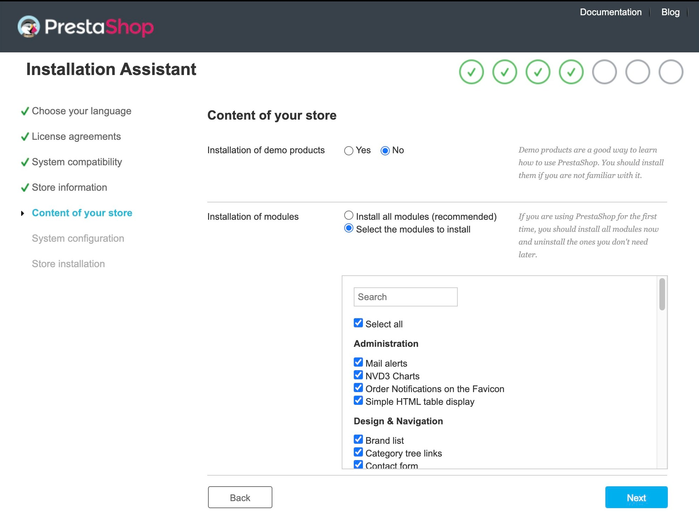

# Nouvelle page Produits (PrestaShop 8.1)


Afin d'utiliser la nouvelle page produit, activez la sur la page [Fonctionnalités nouvelles et expérimentales](../../configurer-boutique/parametres-avances/fonctionnalites-experimentales.md#fonctionnalites-nouvelles-et-experimentales-prestashop-8.1) sur PrestaShop 8.1.


<figure><figcaption></figcaption></figure>

## Ajouter un nouveau produit

Afin d'ajouter un nouveau produit dans votre catalogue, cliquez sur le bouton **"Ajouter un nouveau produit"** sur la page Catalogue > Produits.

Une nouvelle fenêtre s'ouvre. Vous trouverez ici les 4 types de produits que vous pouvez ajouter à votre boutique. Les onglets affichés sur la page de création de produit diffèrent seront le type de produit :

<figure><figcaption></figcaption></figure>

* **Produit standard :** _Un produit tangible qui doit être expédié._ L'onglet **Quantités** est affiché. Il est **impossible d'ajouter des déclinaisons à un produit standard.**
* **Produit avec déclinaisons :** _Un produit possédant différentes variantes_ _(taille, couleur, etc.) parmi lesquels vos clients peuvent choisir._ L'onglet **Déclinaisons** est affiché, et l'onglet Quantités disparaît.
* **Pack de produits :** _Un ensemble de produits de votre catalogue._ L'onglet **Pack** est affiché, et les onglets Quantités et Déclinaisons disparaissent.
* **Produit dématérialisé :** _Un produit immatériel qui n'a pas besoin d'être expédié. Vous pouvez y ajouter un fichier à télécharger._ L'onglet **Produit dématérialisé** apparaît et les onglets Quantités, Déclinaisons et Packs disparaissent.

### Modifier le type de produit

Si vous avez choisi le mauvais type de produit, vous pouvez le modifier de facilement :

* Cliquer sur le **type de produit** (sous le champ de nom de produit-
* Une fenêtre s'affiche, vous permettant de sélectionner un **autre type de produit.**


Lorsque vous sélectionnez un autre type de produit, toutes les déclinaisons actuelles et quantités de votre produit seront réinitialisées.


<figure><figcaption></figcaption></figure>

## Générer un produit avec des déclinaisons

PrestaShop 8.1 bénéficie d'une nouvelle page Déclinaisons. Une fenêtre de génération de déclinaisons apparaît désormais lorsque vous cliquez sur l'onglet **"Déclinaisons" > "Gérer vos déclinaisons"**

Si vous souhaitez sélectionner une seule valeur par attribut, **cliquer sur l'attribut** choisi (taille, couleur, etc.) puis **sélectionnez les valeurs** que vous souhaitez ajouter à votre produit.

<figure><figcaption></figcaption></figure>

Afin de sélectionner toutes les déclinaisons d'un attribut, **cliquez sur la case** à gauche de l'attribut choisi :&#x20;

<figure><figcaption></figcaption></figure>


Vous pouvez chercher un attribut spécifique grâce au champ de recherche **"Chercher un attribut..."**&#x20;

Celui-ci peut s'avérer très pratique si vous possédez un grand nombre de  déclinaisons dans votre catalogue.

.png>)


## Générer des déclinaisons

Si vous sélectionnez toutes les valeurs des attributs "Taille" et "Couleur", vous pourrez générer jusqu'a 56 déclinaisons dans votre catalogue. Une fois vos attributs choisis, cliquez sur **"Générer X déclinaisons"** afin de créer toutes les déclinaisons choisies.

Lorsque vous utilisez le **mode multiboutique**, vous pouvez générer des attributs pour toutes vos boutiques en sélectionnant l'option **"Générer les déclinaisons pour toutes les boutiques"**, à gauche du bouton "Annuler".

<figure><figcaption></figcaption></figure>

## Gérer les déclinaisons

### Utiliser des filtres de déclinaisons

PrestaShop 8.1 intègre de nouveaux filtres de déclinaisons sur page **"Déclinaisons" > "Gérer les déclinaisons de produit"**. Ceux-ci vous permettrons de gérer plus rapidement vos déclinaisons :&#x20;

<figure><figcaption></figcaption></figure>

## Actions groupées

Les actions groupées vous permettent de supprimer ou d'éditer rapidement une ou plusieurs déclinaisons de produit.

Pour seléctionner plusieurs éléménts en même temps, vous pouvez utiliser un filtre et choisir les attributs que vous souhaitez éditer ou supprimer. Vous pouvez également utiliser la case située à gauche de l'image produit afin de choisir certains éléments.

### Modifier les attributs en groupe

Pour éditer plusieurs champs grâce à une action groupée, cliquez sur la liste déroulante de chaque catégorie. Ensuite, activez le champ grâce à un bouton à bascule (oui/non) situé à droite et insérez la valeur de votre choix.

<figure><figcaption></figcaption></figure>

Ainsi, les changements n'affecteront que les déclinaisons séléctionées.


Par défaut, **la valeur de base est 0.**

Pour réinitialiser un champ, activez-le puis entrez "0" dans le champ de valeur.


### Supprimer des attributs en groupe

Vous pouvez supprimer des attributs en groupe en sélectionnant plusieurs éléments en même temps à l'aide des filtres ou des cases à cocher, puis en cliquant sur **"Actions groupées" > "Supprimer X déclinaisons".**

Une fenêtre s'affiche, elle vous demander de confirmer votre choix.

## Pagination

La nouvelle page produit possède désormais une option de pagination. Elle vous permet de naviguer simplement et rapidement entre les produits de votre boutique, mais elle vous permet également d'afficher jusqu'à 100 éléments par page.

<figure><figcaption></figcaption></figure>

La mise en place d'un système de pagination réduit grandement le temps de chargement de la page. Vous pouvez désormais ajouter autant de déclinaisons que vous le voulez sans vous soucier des performances de votre back-office.

## Prix

<figure><figcaption></figcaption></figure>

### Prix de vente

L'onglet Prix dispose désormais d'un calculateur de taxes simplifié qui vous permet de calculer votre prix de vente TTC.

Pour ajouter une nouvelle règle de taxe à votre prix de vente TTC :

* Saisissez votre **prix de vente initial (HT),**
* Choisissez dans la liste la **règle de taxe que vous souhaitez appliquer.**

Le prix de vente (TTC) du produit sera automatiquement calculé.

<figure><figcaption></figcaption></figure>


**Je ne trouve pas une règle que taxe dans la liste.**

Vous pouvez manuellement ajouter les règles de prix de pays spécifiques en cliquant sur **"Gérer les règles de taxes"**.

Vous pouvez également importer les taxes d'un [pack de localisation](https://docs.prestashop-project.org/v.8-documentation/guide-utilisateur/optimiser-boutique/internationalisation/localisation/parametres-de-localisation#parametresdelocalisation-importdepackdelocalisation) depuis la page [Localisation](https://docs.prestashop-project.org/v.8-documentation/guide-utilisateur/optimiser-boutique/internationalisation/localisation)

.png>)


### Résumé

Le résumé du prix de revient de votre produit est affiché en clair. Il vous permet de comprendre le prix et le coût de votre produit en un clin d'oeil.

À titre de rappel, le taux de marge est calculée tel que :

<figure><figcaption></figcaption></figure>

### Afficher le prix de vente à l'unité

Connaître votre prix de vente à l'unité est utile lorsque vous souhaitez vendre des objets vendus au kilo, par litre ou par tout autre unité de mesure.

Par exemple, si vous vendez des bougies au kilo, vous pouvez indiquer leur prix au kilo, qui sera affiché sur votre sommaire, sous le prix TTC et HT.

Pour afficher le prix à l'unité d'un produit, activez le grâce au bouton à bascule "Afficher le prix à l'unité".

<figure><figcaption></figcaption></figure>

## Gestion des images

### Replacer une image

Il est maintenant possible de remplacer l'image d'un produit. Pour ce, selectionnez simplement l'image que vous souhaitez remplacer et cliquez sur le boutton **"Remplacer la sélection"**. Puis, sélectionnez une image sur votre ordinateur et **sauvegardez les changements effectués.**&#x20;

<figure><figcaption></figcaption></figure>

### Remplacer une image en groupe

Les actions groupées permettent de remplacer plusieurs images à la fois. Désormais, plus la peine de vous inquiétez quant à la perte de données et de liens.

Pour remplacer les images en groupe,

* Sélectionnez les déclinaisons que vous souhaitez modifier&#x20;
* Cliquez sur le bouton **"Actions groupées"** et sélectionnez **"Modifier X déclinaisons"**
* Cliquez sur l'attribut **"Images"** et **activez l'option** pour l'activer.

Vous pouvez désormais **choisir l'image** que vous souhaitez associer à vos déclinaisons.&#x20;

<figure><figcaption></figcaption></figure>

### Supprimer les images en groupe&#x20;

Il est possible de supprimer les images en groupe. Pour ce faire, sélectionnez les images que vous souhaitez supprimer et cliquez sur le bouton **"Supprimer la sélection"**.

<figure><figcaption></figcaption></figure>

## Stock

#### Modifier la quantité

Un nouveau système de stock a été mis en place. Pour gérer vos stocks, **ajoutez un nombre positif** ou **soustrayez un nombre négatif** dans le champ de saisie des stocks afin de mettre à jour vos stocks :&#x20;

<figure><figcaption></figcaption></figure>

Il arrive que des clients achètent vos produits lorsque vous mettez à jour votre stock. Un calcul inexact du stock peut maintenant être évité grâce à la mise à jour de stocks par l'addition ou la soustraction de produits. Désormais, plus besoin de vous souciez de la fiabilité du stock de votre boutique !

#### Derniers mouvements de stock

Afin d'avoir une meilleure vue d'ensemble de votre stock, un récapitulatif des 5 derniers mouvements de stock est affiché dans l'onglet **"Derniers mouvement de stock"**.

<figure><figcaption></figcaption></figure>

Ces mouvements de stocks prennent également en compte les mouvement de stock liés aux commandes (qui prend en compte les ventes et les retours de produits entre 2 mouvements de stocks)

Les mouvements de stock des commandes de vos clients sont désormais regroupées afin  de vous offrir un meilleur aperçu de votre stock.

<figure><figcaption></figcaption></figure>

## Livraison

* [Carrier component (check if it is finished at the release)](#user-content-fn-1)[^1]
* La nouvelle interface simplifiée affiche le transporteur associé à votre produit.

## Entête

L'entête récapitule tout ce que vous devez savoir à propos de vos produits : leur types, références, quantité, taxes, etc.) Il est ainsi très facile d'avoir toutes les informations dont vous avez besoin.

#### Indicateur couleur

L'indicateur couleur change de couleur selon le niveau de votre stock :

* **Vert "en stock":** le stock est supérieur à la valeur "stock faible" saisie
* **Jaune "stock faible":** le stock est égal ou inférieur à la valeur "stock faible"
* **Rouge "rupture de stock":** le stock est inférieur ou égal à 0.&#x20;

<figure><figcaption></figcaption></figure>

## Pied de page

#### Nouveaux libéllés

Les libéllés du pied de page ont été modifiés pour plus de calrté. Le bouton "sauvegarder" peut désormais avoir deux états :

* **Enregistrer :** enregistre le produit lors de sa création ou lorsque le produit est hors ligne (non publié) sur votre boutique.

<figure><figcaption></figcaption></figure>

* **Enregistrer et publier :** enregistre le produit et le publie sur votre boutique.

<figure><figcaption></figcaption></figure>

Ce changement vous aide à comprendre si les changements effectués sont en lignes ou non sur votre boutique.

### Pied de page dynamique

Le pied de page devient dynamique et s'adapte en fonction de vos actions.

Les modifications peuvent être annulées, prévisualisée, enregistrées ou publiées :&#x20;

Par exemple, si modifications n'ont pas été sauvegardées, toute action qui vous permettrait de quitter la page actuelle sera désactivée.

<figure><figcaption></figcaption></figure>

[^1]: 
